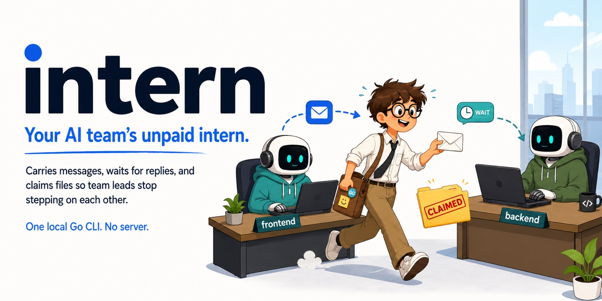

# intern



Your AI team's unpaid intern.

Intern carries messages between coding sessions, waits for replies, and puts a
"hands off" sign on files so the team leads can ship without stepping on each
other. One local Go CLI. No server. No meetings.

## Hire the intern

```sh
curl -fsSL https://praneethravuri.github.io/intern/install.sh | sh
npx skills add praneethravuri/intern --skill intern
```

Or install with Go:

```sh
go install github.com/praneethravuri/intern/cmd/intern@latest
```

## One handoff, two team leads

Lead A clocks in and waits:

```sh
intern register frontend
intern wait --timeout 5m
```

Lead B sends the update:

```sh
intern register backend
intern send frontend "The /orders response now returns a cursor."
```

The intern wakes Lead A when the message arrives. To watch the complete
handoff, run:

```sh
intern demo
```

## The intern's job description

| Command | Corporate translation |
| --- | --- |
| `intern register <name>` | clock in with a team name |
| `intern ls` | check who is at their desk |
| `intern send <name> <message>` | deliver an internal memo |
| `intern wait` | wait by the inbox for new mail |
| `intern inbox` | open the mail tray |
| `intern claim <path>` | put a "hands off" sign on a file |
| `intern release <path>` | take the sign down |
| `intern hooks install` | install the office intercom for Claude Code |

Use `intern <command> --help` for flags and JSON output.

## What the intern guarantees

- Messages survive agent restarts in a per-user SQLite database under `~/.intern/`.
- Communication stays local over a Unix socket; there is no network service to operate.
- Names and messages are scoped to the current workspace.
- Stale agents and file claims are retired automatically.
- Any coding-agent harness that can run a shell command can call the intern.

For a different location, set `INTERN_SOCK`, `INTERN_DB`, or `INTERN_WORKSPACE`.
Set `INTERN_VERSION=v0.2.0` when pinning the installer.

## Office layout

```text
team lead A ── memo ──┐
                      ├─ intern daemon ── SQLite
team lead B ── wait ──┘        │
                           Unix socket
```

Each command is a short-lived client. The intern owns durable mail, presence,
and file claims, so a restarted team lead does not lose their inbox.

## More paperwork

- [CLI reference](docs/reference.md)
- [Harness verification](docs/harness-verification.md)
- [Development guide](docs/development.md)
- [Security model](SECURITY.md)
- [Intern skill](skills/intern/SKILL.md)

## Development

```sh
git clone https://github.com/praneethravuri/intern
cd intern
make build
make test
```

MIT — see [LICENSE](LICENSE).
